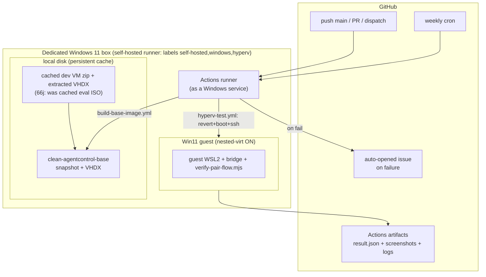
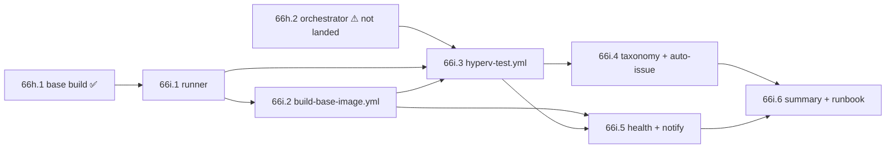

# Phase 66i — CI automation for the Hyper-V test harness (blueprint)

Docs-only design. Goal: take the five manual steps a dogfood cycle costs today
(Phase 66h) to **zero** — the user pushes to a branch and gets a test-result
report with screenshots and logs, no interactive intervention.

> **Phase 66j update (base-image pivot).** The base builder is no longer the ISO
> flow. **66j** replaced `Build-BaseImage.ps1` with **`Import-DevVM.ps1`** — it
> imports Microsoft's pre-built "Windows 11 dev environment" from the Hyper-V
> gallery `disk.uri` and provisions it over PowerShell Direct. This **massively
> simplifies 66i**: no ~90-min babysat base build (it's *download image + import
> + snapshot*, ~10-20 min unattended), no ISO to source (P1 gone), and most of
> the §4.3 ISO-flow bug taxonomy no longer applies to the primary path. The
> spots this changes are marked **[66j]** below; the ISO-specific machinery
> survives only for the deprecated `Build-BaseImage-FromIso.ps1` fallback.

> **Scope note / dependency.** As of this blueprint the base builder (now
> **`Import-DevVM.ps1`** + `Update-DevVM.ps1`, 66j; formerly 66h.1's
> `Build-BaseImage.ps1`) has landed. The per-run driver
> `hyperv-test-orchestrator.sh` + `runner-vm.ps1` (66h.2) is designed in
> `scripts/hyperv-test/BLUEPRINT.md` §3 but **not yet in the tree**;
> `verify-pair-flow.mjs` (66g) is. 66i wraps both in CI, so **66i.3 has a hard
> dependency on 66h.2 orchestrator existing** — see §3.

---

## 1. Current pain points (concrete)

Every dogfood cycle today, from the 66h ops experience:

| # | Manual step | Time / friction | Why it blocks |
|---|---|---|---|
| P1 | ~~Download Win11 Enterprise eval ISO from evalcenter~~ **[66j] gone** — `Import-DevVM.ps1` auto-downloads + sha256-verifies the gallery dev VM image | ~0 (unattended download) | *Was* a manual 6.7 GB click-through with no stable URL; now resolved from the gallery manifest |
| P2 | Open **elevated** PowerShell by hand | seconds, but requires a human at the GUI | Hyper-V cmdlets + VHDX ops + ACLs need admin |
| P3 | Run the base builder and **watch** | **[66j] ~10-20 min unattended** (was ~90 min babysat) | `Import-DevVM.ps1` is *download + import + PowerShell-Direct provision + snapshot* — no ISO→VHDX conversion, no in-guest first-boot to babysit |
| P4 | React interactively to failures | unbounded | Login VM via Hyper-V GUI, read logs, fix, re-run. **[66j]** the ISO-flow bugs (§4.3 T2/T4/T5) can't occur on the import path |
| P5 | Run `hyperv-test-orchestrator.sh` per iteration | ~12 min attended + manual result read | Not tied to any git event; results live only on the box |

Net **[66j]**: **~10-20 min unattended for a base import + ~12 min attended per
test run**, and the import needs no re-babysitting — `slmgr /rearm` keeps each
reverted snapshot licensed and `Update-DevVM.ps1` refreshes the image only when
Microsoft's gallery hash moves. The machine is also the user's WSL/Claude host,
so a run competes with live work (§5 R1).

---

## 2. Target architecture

### 2.1 The constraint that decides it

Nested Hyper-V is **not available on GitHub-hosted Windows runners** — they run
as Azure VMs on SKUs that don't expose `ExposeVirtualizationExtensions`. The
whole harness exists *because* WSL2-in-a-guest needs nested virt (66h BLUEPRINT
§Why-Sandbox). So **any option that relies on hosted runners for the VM jobs is
off the table.** That eliminates a pure Option C and the "hosted per-run" half
of Option D as literally written.

The repo **already registers `self-hosted` runners** (`ci.yml` uses
`runs-on: self-hosted`), and 66h's core motivation was to stop test runs from
colliding with the host's live WSL. A **dedicated self-hosted Windows box**
solves both: it *is* the Hyper-V host, and dedicating it means no WSL/Claude
contention (§5 R1).

### 2.2 Decision — **Option D, reframed as self-hosted + temporal split**

| Option | Verdict |
|---|---|
| **A** self-hosted Windows runner | ✅ The only viable *substrate* (nested virt) — but "one workflow" wastes the 90-min base build on every run |
| **B** Task Scheduler cron | ❌ Not tied to git events; results never reach the Actions tab / PR |
| **C** cloud Windows runner | ❌ Hosted GH runners have no nested virt; a self-managed Azure Dv5-nested VM = A with a cloud bill and ISO/VHDX egress cost |
| **D** hybrid (expensive base once, cheap per-run) | ✅ **Chosen** — but the split is **temporal, both on the same self-hosted box**, because the cheap half also needs nested virt. Base rebuild = weekly/on-demand; per-run = per-push. The golden snapshot is the shared cache |

**Why not "hosted for the fast per-run" (D as literally worded):** the per-run
still boots WSL2 inside the guest → still needs nested virt → still self-hosted.
So the caching win is real, but the runner is the same box for both jobs.

**The "artifact" is the on-box snapshot, not an uploaded VHDX.** A 20 GB VHDX
blows past artifact limits and costs egress every run. The base workflow leaves
`clean-agentcontrol-base` on the box's disk; per-run reverts to it locally. Only
a **small build manifest** (edition, build date, eval-expiry, log tail) is
uploaded so other workflows can assert freshness without touching the disk.

### 2.3 Topology

---

## 3. Sub-phase plan (6 sub-PRs)

| PR | Deliverable | Depends on |
|---|---|---|
| **66i.1** | Self-hosted **runner setup**: `Register-HyperVRunner.ps1` (self-registers via short-lived `gh api` runner token, installs as a Windows service, labels `windows,hyperv`), `Preflight-Host.ps1` (asserts admin, Hyper-V, ≥40 GB, nested-virt capable), docs `scripts/hyperv-test/RUNNER-SETUP.md` | 66j |
| **66i.2** **[66j]** | **`build-base-image.yml`**: `workflow_dispatch` + `schedule`. Runs **`Update-DevVM.ps1`** (no-op unless the gallery hash moved) — which delegates to `Import-DevVM.ps1 -Force`, snapshots on-box, uploads `base-manifest.json` (imported hash + eval-rearm state). No ISO ensure, no `Test-Unattend`; preflight is the §4.3 **[66j]** import-path checks | 66i.1 |
| **66i.3** | **`hyperv-test.yml`**: `push:main` + `pull_request` + `dispatch`. Asserts snapshot fresh (reads manifest), runs `hyperv-test-orchestrator.sh`, uploads `result.json` + `pair-flow.json` + screenshots + `first-boot.log`. `STRICT` toggle mirrors `macos-test.yml` | 66i.1, **66h.2 orchestrator** |
| **66i.4** | **Failure taxonomy suite + auto-issue**: `Test-HypervConfig.ps1` Pester tests encoding the 66h bugs (§4.3), wired as an **always-runs (hosted, no VM)** job so config regressions gate every PR. On `hyperv-test.yml` failure: `report-failure.mjs` opens a GH issue with logs + screenshots; optional Phase 43 nested-delegation fix teammate | 66i.3 |
| **66i.5** | **Runner health + notify**: scheduled `runner-health.yml` — `gh api` runner online-status + manifest staleness; issue/notify if runner offline > 24 h or base > N days. Failure-only email/Slack | 66i.2, 66i.3 |
| **66i.6** | **`PHASE-66I-SUMMARY.md`** + zero-touch runbook (one-time box setup → steady state) | 66i.1–.5 |

Mostly linear; 66i.4/.5 can land in parallel once .3 is green.

---

## 4. Automation candidates beyond core

### 4.1 [66j] Auto-provision the base image (kills P1)

The dev-VM pivot resolves P1 with no ISO plumbing at all — `Import-DevVM.ps1`
downloads the image from the gallery `disk.uri` and sha256-verifies it, and
`Update-DevVM.ps1` decides when a refresh is even needed:

| Approach | Verdict |
|---|---|
| **`Update-DevVM.ps1` on the box: refetch gallery manifest, hash-diff vs `imported-image.json`, rebuild only on drift** | ✅ Primary — cheap no-op the rest of the time; the extracted VHDX + snapshot are cached on-box for weeks |
| Cache the extracted VHDX / zip on the box's disk between runs | ✅ Built in — `Import-DevVM.ps1` reuses the cached, hash-checked zip; a full re-download only on drift or `-Force` |
| Private mirror of the dev VM zip (`-DiskUri`/`-DiskSha256` override) | ✅ Fallback if Microsoft pulls the gallery entry (R2 in `BLUEPRINT.md` §7) |

`build-base-image.yml` just calls `Update-DevVM.ps1`: hash unchanged → nothing to
do; changed → `Import-DevVM.ps1 -Force` re-imports + re-snapshots. The imported
hash + `slmgr /rearm` state live in `base-manifest.json` so 66i.5 can warn before
rearms run out (the eval is kept live by rearm, not by re-download).

### 4.2 One-shot runner auto-registration (kills P2)

`Register-HyperVRunner.ps1` run **once** on the box: mints a runner token via
`gh api -X POST repos/{owner}/{repo}/actions/runners/registration-token`,
configures with labels `windows,hyperv`, installs via `svc.cmd install` so it
survives reboot and never needs an attended elevated shell again. Steady state:
the box just needs to be powered on.

### 4.3 Failure-mode taxonomy → always-run regression tests (kills most of P4)

The four bugs this session cost a full attended base-build cycle *each*. Encode
them as **fast, VM-free** checks (`Test-HypervConfig.ps1`, Pester) that run on a
**hosted** runner on every PR — so they gate config in CI seconds, with no box.

**[66j]** Most of these were **ISO-flow** bugs: T2 (AutoUnattend), T4
(`Convert-WindowsImage`) and T5's rootfs URL **cannot occur on the import path**,
which has no AutoUnattend, no `Convert-WindowsImage`, and (by default) no rootfs
URL. They still gate the deprecated `Build-BaseImage-FromIso.ps1`. The import
path introduces a **smaller, different** taxonomy (T6–T8):

| # | Bug (66h PR) | Applies to | Regression assertion |
|---|---|---|---|
| T1 | UTF-8-no-BOM encoding (#47) | both | Every `hyperv-test/*.ps1`/`.xml` starts with a UTF-8 BOM; no bare em-dash in `.ps1` string literals |
| T2 | AutoUnattend `RunSynchronous` placement (#49) | ISO only | Load `AutoUnattend.xml`; assert well-formed **and** `RunSynchronous` under `Microsoft-Windows-Deployment`, not `Shell-Setup` |
| T3 | SSH-probe stderr crash (#48) | ISO (probe) | Static-scan the ISO builder: probe inside `try/catch` + guarded by `$LASTEXITCODE` |
| T4 | `-VHDType` param binding (#47) | ISO only | Assert no `-VHDType` argument in the `Convert-WindowsImage` call |
| T5 | Stale Ubuntu rootfs URL / silent phases (#47/#44) | ISO only | URL matches `/wsl/releases/`; every long phase emits a heartbeat |
| **T6** **[66j]** | Gallery manifest trailing commas | import | `Import-DevVM.ps1`/`Update-DevVM.ps1` strip `,(\s*[}\]])` before `ConvertFrom-Json` (a raw parse of the real manifest throws) |
| **T7** **[66j]** | Gallery image integrity | import | The download is **sha256-verified** against the manifest `disk.hash` before the VM is created |
| **T8** **[66j]** | PowerShell Direct credential drift | import | Connect tries `User` blank then `Passw0rd!`, and surfaces a clear `-GuestUser/-GuestPassword` hint on timeout |

This is the highest-leverage automation: it turns "lose a cycle to a typo" into
"PR check fails in 30 s on a free hosted runner."

### 4.4 Result parsing → actionable issue (kills P5 read + P4 triage)

`report-failure.mjs` greps `result.json` for `"pass": true`; on failure opens/updates
a GH issue titled by failing step, attaching the uploaded screenshots + `first-boot.log`
tail + the guest `provisioning-failed.txt`. Optionally spawns a Phase 43
nested-delegation fix teammate seeded with that context.

---

## 5. Risks

| # | Risk | Mitigation |
|---|---|---|
| R1 | **WSL/Claude vs harness contention** — 66h.1 built the VHDX only because the host WSL was up, and a run competes with live work | **Dedicate** the box to Windows/Hyper-V (this whole architecture). No Claude session on it → no `wsl --shutdown` fear, no CPU contention |
| R2 | **Runner offline = no CI** | 66i.5 health monitor + install-as-service (auto-start on reboot); the §4.3 taxonomy suite runs **hosted**, so config still gates even with the box down |
| R3 | **Runner registration secret** | Prefer a **GitHub App** (least-priv, `actions` scope) or short-lived registration token minted at setup; avoid a broad long-lived PAT. Secret lives only on the box + in repo Actions secrets |
| R4 **[66j]** | **Eval licensing** — the gallery dev VM is a 90-day Enterprise Eval, already expired | `Import-DevVM.ps1` runs `slmgr /rearm` (+ reboot) so each reverted snapshot boots licensed; rearms are finite (~5), so 66i.5 warns as the rearm budget or eval-expiry nears and `Update-DevVM.ps1` pulls a fresh image when the gallery hash moves. (No ISO/AutoUnattend key path on the primary flow) |
| R5 | **20 GB VHDX not artifact-friendly** | Snapshot stays **on-box**; only a small manifest is uploaded. Periodic differencing-disk merge/rebuild (66h risk #3) folded into the weekly base job |
| R6 | **Single VM → no parallel runs** | `concurrency: group: hyperv-test` `cancel-in-progress: true`; ~12 min/run is fine serialized for a pre-merge gate |
| R7 | **Non-ephemeral runner state drift** | Per-run always `Restore-VMSnapshot` + `Stop-VM -TurnOff`; runner workspace `actions/checkout` clean each job; weekly base rebuild resets accreted state |

---

## 6. Success criteria

- [ ] **Zero** manual steps for a test run — push to a branch → report appears in the Actions tab
- [ ] Base VHDX rebuilt automatically weekly (and on `dispatch`), re-arming the eval clock
- [ ] Per-run completes in **< 15 min** (revert + boot + install + verify), reusing the cached snapshot
- [ ] Failures produce an actionable GH issue with `result.json` + screenshots + `first-boot.log`
- [ ] User notified (email/Slack) **only on failure**
- [ ] Config regressions (the §4.3 taxonomy) fail on a **hosted** PR check in seconds, needing no box

---

## 7. Locked decisions (owner-confirmed — implementers' source of truth)

These were the open questions; the owner has now **locked** them. Treat this
section as authoritative for the 66i.1–66i.6 briefs — do not re-litigate.

| # | Decision | Locked answer | Implementer impact |
|---|---|---|---|
| D1 | **Host** | **Multi-purpose machine now → dedicated box later.** Interim runs on the user's machine in dedicated off-hours time-slots; design so the switch to a dedicated box is a config change, not a rewrite | 66i.1: parameterize all host-specific bits (work dir, switch name, ISO path, **off-hours/time-slot guard**) via env-vars + document the dedicated-box cutover in `RUNNER-SETUP.md`. 66i.3: `hyperv-test.yml` carries an **off-hours concurrency window** for the shared-box interim so runs don't collide with the user's live WSL |
| D2 | **Base-rebuild cadence** | **Monthly**, with a **60-day-before-90-day-eval-expiry** trigger. Weekly is overkill for infra that rarely changes | 66i.2: cron → monthly `schedule`. 66i.5: health monitor warns + triggers a rebuild when `base-manifest.json` eval-expiry is **< 60 days** out. **[66j] revisit:** the import path decouples two things the ISO cadence conflated — (a) *licensing*, now kept live cheaply by `slmgr /rearm` each import (no full rebuild needed), and (b) *image freshness*, driven by `Update-DevVM.ps1` hash-drift (Microsoft refreshes the gallery ~quarterly). Monthly `Update-DevVM.ps1` is a cheap no-op until either the rearm budget nears exhaustion or the gallery hash moves. Owner to reconfirm cadence under 66j |
| D3 | **Runner secret** | **GitHub App (short-lived registration token)** — no long-lived PAT | 66i.1: `Register-HyperVRunner.ps1` mints the registration token via the App, not a PAT (R3) |
| D4 | **Notify channel** | **Email initially**; Slack is a follow-up once a workspace exists | 66i.4/66i.5: failure-only notification via email; leave a Slack seam but don't build it yet |

Ready for the 66i.1 fan-out.

## Sources

- `scripts/hyperv-test/BLUEPRINT.md` (66h architecture), `README.md` (ops steps)
- 66h.1 bugfix PRs #44/#47/#48/#49 (the §4.3 taxonomy)
- `.github/workflows/{ci.yml,macos-test.yml}` (self-hosted + artifact precedent)
- [Enable nested virtualization (Hyper-V)](https://learn.microsoft.com/en-us/windows-server/virtualization/hyper-v/enable-nested-virtualization)
- [Self-hosted runners — adding & security](https://docs.github.com/en/actions/hosting-your-own-runners/managing-self-hosted-runners/adding-self-hosted-runners)
