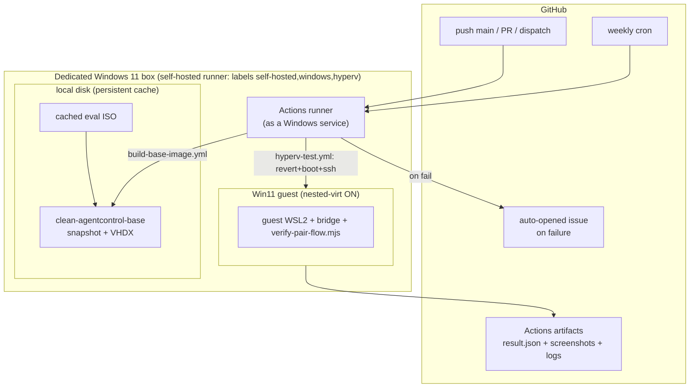
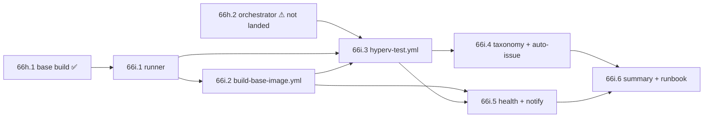

# Phase 66i — CI automation for the Hyper-V test harness (blueprint)

Docs-only design. Goal: take the five manual steps a dogfood cycle costs today
(Phase 66h) to **zero** — the user pushes to a branch and gets a test-result
report with screenshots and logs, no interactive intervention.

> **Scope note / dependency.** As of this blueprint only **66h.1**
> (`Build-BaseImage.ps1` + `AutoUnattend.xml` + `First-Boot.ps1`) has actually
> landed (PRs #42/#44/#47/#48/#49). The per-run driver
> `hyperv-test-orchestrator.sh` + `runner-vm.ps1` (66h.2) is designed in
> `scripts/hyperv-test/BLUEPRINT.md` §3 but **not yet in the tree**;
> `verify-pair-flow.mjs` (66g) is. 66i wraps both in CI, so **66i.3 has a hard
> dependency on 66h.2 orchestrator existing** — see §3.

---

## 1. Current pain points (concrete)

Every dogfood cycle today, from the 66h ops experience:

| # | Manual step | Time / friction | Why it blocks |
|---|---|---|---|
| P1 | Download Win11 Enterprise eval ISO from evalcenter | ~15 min, 6.7 GB, manual click-through | No stable direct URL; re-needed every 90 days when eval expires |
| P2 | Open **elevated** PowerShell by hand | seconds, but requires a human at the GUI | Hyper-V cmdlets + VHDX mount + ACLs need admin |
| P3 | Run `Build-BaseImage.ps1 -Verbose` and **watch** ~90 min | 90 min attended | Silent long phases (ISO→VHDX, WSL provision) — user babysits for errors |
| P4 | React interactively to failures | unbounded | Login VM via Hyper-V GUI, read `first-boot.log`, fix, re-run. The 4 bugs in §4.3 each cost a full attended cycle |
| P5 | Run `hyperv-test-orchestrator.sh` per iteration | ~12 min attended + manual result read | Not tied to any git event; results live only on the box |

Net: **~90 min attended for a base build + ~12 min attended per test run**, and
the base build must be re-babysat on every eval-license rebuild. The machine is
also the user's WSL/Claude host, so a run competes with live work.

---

## 2. Target architecture

### 2.1 The constraint that decides it

Nested Hyper-V is **not available on GitHub-hosted Windows runners** — they run
as Azure VMs on SKUs that don't expose `ExposeVirtualizationExtensions`. The
whole harness exists *because* WSL2-in-a-guest needs nested virt (66h BLUEPRINT
§Why-Sandbox). So **any option that relies on hosted runners for the VM jobs is
off the table.** That eliminates a pure Option C and the "hosted per-run" half
of Option D as literally written.

The repo **already registers `self-hosted` runners** (`ci.yml` uses
`runs-on: self-hosted`), and 66h's core motivation was to stop test runs from
colliding with the host's live WSL. A **dedicated self-hosted Windows box**
solves both: it *is* the Hyper-V host, and dedicating it means no WSL/Claude
contention (§5 R1).

### 2.2 Decision — **Option D, reframed as self-hosted + temporal split**

| Option | Verdict |
|---|---|
| **A** self-hosted Windows runner | ✅ The only viable *substrate* (nested virt) — but "one workflow" wastes the 90-min base build on every run |
| **B** Task Scheduler cron | ❌ Not tied to git events; results never reach the Actions tab / PR |
| **C** cloud Windows runner | ❌ Hosted GH runners have no nested virt; a self-managed Azure Dv5-nested VM = A with a cloud bill and ISO/VHDX egress cost |
| **D** hybrid (expensive base once, cheap per-run) | ✅ **Chosen** — but the split is **temporal, both on the same self-hosted box**, because the cheap half also needs nested virt. Base rebuild = weekly/on-demand; per-run = per-push. The golden snapshot is the shared cache |

**Why not "hosted for the fast per-run" (D as literally worded):** the per-run
still boots WSL2 inside the guest → still needs nested virt → still self-hosted.
So the caching win is real, but the runner is the same box for both jobs.

**The "artifact" is the on-box snapshot, not an uploaded VHDX.** A 20 GB VHDX
blows past artifact limits and costs egress every run. The base workflow leaves
`clean-agentcontrol-base` on the box's disk; per-run reverts to it locally. Only
a **small build manifest** (edition, build date, eval-expiry, log tail) is
uploaded so other workflows can assert freshness without touching the disk.

### 2.3 Topology

---

## 3. Sub-phase plan (6 sub-PRs)

| PR | Deliverable | Depends on |
|---|---|---|
| **66i.1** | Self-hosted **runner setup**: `Register-HyperVRunner.ps1` (self-registers via short-lived `gh api` runner token, installs as a Windows service, labels `windows,hyperv`), `Preflight-Host.ps1` (asserts admin, Hyper-V, ≥40 GB, nested-virt capable), docs `scripts/hyperv-test/RUNNER-SETUP.md` | 66h.1 |
| **66i.2** | **`build-base-image.yml`**: `workflow_dispatch` + weekly `schedule`. Ensures ISO (§4.1), runs `Build-BaseImage.ps1 -Force`, snapshots on-box, uploads `base-manifest.json`. Runs `Test-Unattend` + encoding preflight (§4.3) **first** so config bugs fail in seconds | 66i.1 |
| **66i.3** | **`hyperv-test.yml`**: `push:main` + `pull_request` + `dispatch`. Asserts snapshot fresh (reads manifest), runs `hyperv-test-orchestrator.sh`, uploads `result.json` + `pair-flow.json` + screenshots + `first-boot.log`. `STRICT` toggle mirrors `macos-test.yml` | 66i.1, **66h.2 orchestrator** |
| **66i.4** | **Failure taxonomy suite + auto-issue**: `Test-HypervConfig.ps1` Pester tests encoding the 66h bugs (§4.3), wired as an **always-runs (hosted, no VM)** job so config regressions gate every PR. On `hyperv-test.yml` failure: `report-failure.mjs` opens a GH issue with logs + screenshots; optional Phase 43 nested-delegation fix teammate | 66i.3 |
| **66i.5** | **Runner health + notify**: scheduled `runner-health.yml` — `gh api` runner online-status + manifest staleness; issue/notify if runner offline > 24 h or base > N days. Failure-only email/Slack | 66i.2, 66i.3 |
| **66i.6** | **`PHASE-66I-SUMMARY.md`** + zero-touch runbook (one-time box setup → steady state) | 66i.1–.5 |

Mostly linear; 66i.4/.5 can land in parallel once .3 is green.

---

## 4. Automation candidates beyond core

### 4.1 Auto-provision the Win11 eval ISO (kills P1)

| Approach | Verdict |
|---|---|
| **BITS transfer of the evalcenter ISO to a cached path, re-fetched only when missing/expired** | ✅ Primary — `Start-BitsTransfer`, checksum-gated, ~quarterly refresh aligned to the 90-day clock |
| Private Azure Blob / NAS mirror of the ISO | ✅ Fallback if the evalcenter direct link rots (it periodically does); one storage secret |
| Commit ISO to a GH release asset | ❌ 6.7 GB + Microsoft redistribution terms — no |

`build-base-image.yml` calls `Ensure-Iso.ps1`: present + checksum-valid → reuse;
else BITS-download → verify → proceed. The eval expiry lives in
`base-manifest.json` so 66i.5 can warn before it lapses.

### 4.2 One-shot runner auto-registration (kills P2)

`Register-HyperVRunner.ps1` run **once** on the box: mints a runner token via
`gh api -X POST repos/{owner}/{repo}/actions/runners/registration-token`,
configures with labels `windows,hyperv`, installs via `svc.cmd install` so it
survives reboot and never needs an attended elevated shell again. Steady state:
the box just needs to be powered on.

### 4.3 Failure-mode taxonomy → always-run regression tests (kills most of P4)

The four bugs this session cost a full attended base-build cycle *each*. Encode
them as **fast, VM-free** checks (`Test-HypervConfig.ps1`, Pester) that run on a
**hosted** runner on every PR — so they gate config in CI seconds, with no box:

| # | Bug (66h PR) | Symptom | Regression assertion |
|---|---|---|---|
| T1 | UTF-8-no-BOM encoding (#47) | PS 5.1 decodes as CP1252 → `The term 'pass' is not recognized` | Every `hyperv-test/*.ps1`/`.xml` starts with a UTF-8 BOM; no bare em-dash in string literals |
| T2 | AutoUnattend `RunSynchronous` placement (#49) | specialize pass rejected → VM never reaches desktop | Load `AutoUnattend.xml`; assert well-formed XML **and** `RunSynchronous` is under `Microsoft-Windows-Deployment`, never `Shell-Setup` |
| T3 | SSH-probe stderr crash (#48) | early ssh-timeout stderr → terminating `NativeCommandError` kills build | Static-scan `Build-BaseImage.ps1`: the probe is inside `try/catch` + guarded by `$LASTEXITCODE` |
| T4 | `-VHDType` param binding (#47) | `Convert-WindowsImage` SRC set has no `VHDType` → bind error | Assert no `-VHDType` argument in the `Convert-WindowsImage` call |
| T5 | Stale Ubuntu rootfs URL / silent phases (#47/#44) | 404 on old rootfs path; no progress for 20 min | URL matches `/wsl/releases/`; every long phase emits a heartbeat line |

This is the highest-leverage automation: it turns "lose a 90-min cycle to a typo"
into "PR check fails in 30 s on a free hosted runner."

### 4.4 Result parsing → actionable issue (kills P5 read + P4 triage)

`report-failure.mjs` greps `result.json` for `"pass": true`; on failure opens/updates
a GH issue titled by failing step, attaching the uploaded screenshots + `first-boot.log`
tail + the guest `provisioning-failed.txt`. Optionally spawns a Phase 43
nested-delegation fix teammate seeded with that context.

---

## 5. Risks

| # | Risk | Mitigation |
|---|---|---|
| R1 | **WSL/Claude vs harness contention** — 66h.1 built the VHDX only because the host WSL was up, and a run competes with live work | **Dedicate** the box to Windows/Hyper-V (this whole architecture). No Claude session on it → no `wsl --shutdown` fear, no CPU contention |
| R2 | **Runner offline = no CI** | 66i.5 health monitor + install-as-service (auto-start on reboot); the §4.3 taxonomy suite runs **hosted**, so config still gates even with the box down |
| R3 | **Runner registration secret** | Prefer a **GitHub App** (least-priv, `actions` scope) or short-lived registration token minted at setup; avoid a broad long-lived PAT. Secret lives only on the box + in repo Actions secrets |
| R4 | **Eval ISO 90-day licensing** | Weekly rebuild naturally re-arms; manifest tracks expiry; 66i.5 warns ~7 days out. Optional licensed key in AutoUnattend for a permanent base |
| R5 | **20 GB VHDX not artifact-friendly** | Snapshot stays **on-box**; only a small manifest is uploaded. Periodic differencing-disk merge/rebuild (66h risk #3) folded into the weekly base job |
| R6 | **Single VM → no parallel runs** | `concurrency: group: hyperv-test` `cancel-in-progress: true`; ~12 min/run is fine serialized for a pre-merge gate |
| R7 | **Non-ephemeral runner state drift** | Per-run always `Restore-VMSnapshot` + `Stop-VM -TurnOff`; runner workspace `actions/checkout` clean each job; weekly base rebuild resets accreted state |

---

## 6. Success criteria

- [ ] **Zero** manual steps for a test run — push to a branch → report appears in the Actions tab
- [ ] Base VHDX rebuilt automatically weekly (and on `dispatch`), re-arming the eval clock
- [ ] Per-run completes in **< 15 min** (revert + boot + install + verify), reusing the cached snapshot
- [ ] Failures produce an actionable GH issue with `result.json` + screenshots + `first-boot.log`
- [ ] User notified (email/Slack) **only on failure**
- [ ] Config regressions (the §4.3 taxonomy) fail on a **hosted** PR check in seconds, needing no box

---

## 7. Open questions (owner decision)

1. **Dedicated box vs the user's multi-purpose machine?** The architecture assumes
   a *dedicated* Windows host (R1). If none is available, a second-best is a
   scheduled off-hours window on the shared box — but that reintroduces WSL
   contention and loses "push → result." Owner: procure/allocate a box, or accept
   off-hours-only CI?
2. **Base-rebuild cadence — weekly vs aligned-to-90-day-expiry?** Weekly is safe
   but spends ~90 min box-time each week. A ~monthly cadence with a 7-day
   pre-expiry trigger may suffice. Which?
3. **Secret model + notify channel?** GitHub App vs short-lived registration
   token for the runner (R3); and email vs the existing bridge/Slack path for the
   failure-only notification (§6). Both need one owner call before 66i.1/66i.5.

## Sources

- `scripts/hyperv-test/BLUEPRINT.md` (66h architecture), `README.md` (ops steps)
- 66h.1 bugfix PRs #44/#47/#48/#49 (the §4.3 taxonomy)
- `.github/workflows/{ci.yml,macos-test.yml}` (self-hosted + artifact precedent)
- [Enable nested virtualization (Hyper-V)](https://learn.microsoft.com/en-us/windows-server/virtualization/hyper-v/enable-nested-virtualization)
- [Self-hosted runners — adding & security](https://docs.github.com/en/actions/hosting-your-own-runners/managing-self-hosted-runners/adding-self-hosted-runners)
