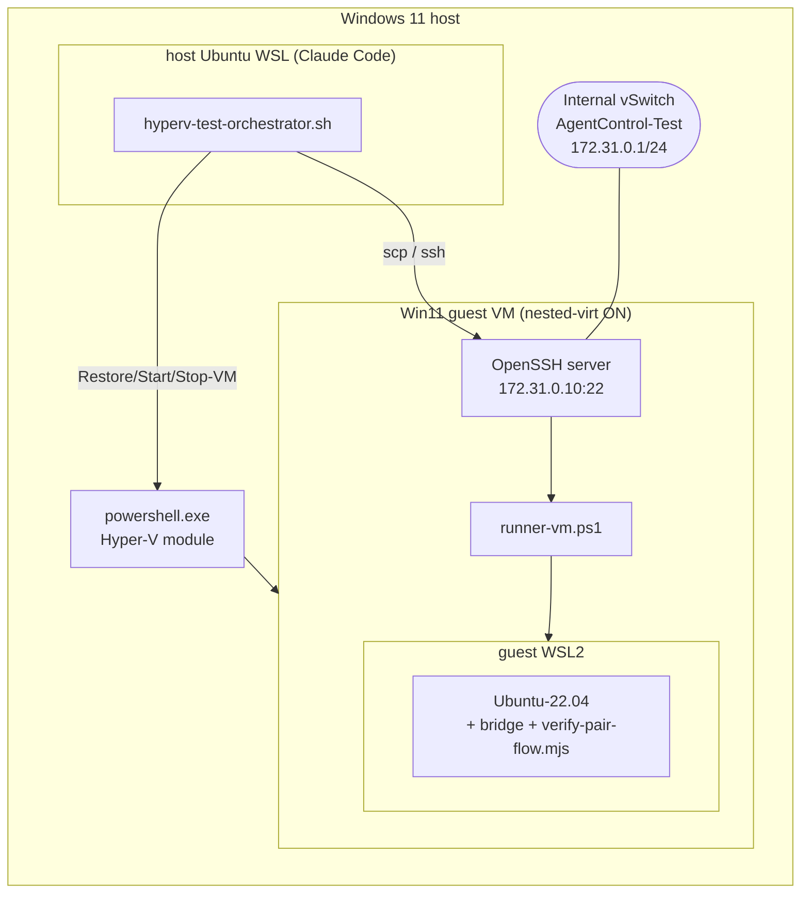

# Phase 66h — Hyper-V VM test harness (blueprint)

Docs-only design for a **persistent Windows 11 Hyper-V VM with nested
virtualization** that runs the full WSL-inclusive installer/pairing test
**without depending on the host's WSL** — the flaw that blocks Phase 66d
(Windows Sandbox).

## Why Windows Sandbox can't do this

| Constraint | Consequence |
|---|---|
| Windows Sandbox + WSL2 both require Hyper-V | They share the host **HNS** (Host Networking Service) |
| Claude Code runs *inside* host Ubuntu WSL | Host WSL is always active during a test |
| Active host WSL vhost + Sandbox HNS collide | Sandbox starts `WindowsSandboxServer` only; **`RemoteSession` never spawns, LogonCommand never fires**, window handle = 0 |
| Fix would be `wsl --shutdown` | That kills Claude Code's own session — non-starter |

Root-cause confirmed via debug: `Get-Process WindowsSandbox*` returns Server
only, sandbox window handle 0, LogonCommand output never written — even after
killing the docker-desktop distro, because host Ubuntu WSL stays active.

**Hyper-V VM approach dodges this:** the VM is a first-class Hyper-V guest (not a
Sandbox container sharing host HNS), and WSL2 runs *inside* the guest via
[nested virtualization](https://learn.microsoft.com/en-us/windows-server/virtualization/hyper-v/enable-nested-virtualization).
The host's WSL is irrelevant — no `wsl --shutdown`, Claude's session survives.

---

## 1. Architecture overview

| Layer | Detail |
|---|---|
| Host | Windows 11 + Hyper-V; Claude Code in host Ubuntu WSL drives via `powershell.exe` |
| Control plane | WSL bash → `powershell.exe -c` → Hyper-V PowerShell module → managed VM |
| Guest VM | Windows 11, 16 GB disk (dynamic VHDX), 8 GB RAM, 4 vCPU, **nested-virt ON** |
| Guest contents | WSL2 kernel + `Ubuntu-22.04` pre-provisioned + Windows **OpenSSH server** |
| Data channel | SSH (WSL host → VM) over a **Hyper-V Internal switch** (static host-only IP) |
| Reset model | `Restore-VMSnapshot clean-agentcontrol-base` before every run |



---

## 2. VM base image construction (one-time) — `Import-DevVM.ps1`

> **Phase 66j pivot.** The base image is now **imported from Microsoft's
> pre-built "Windows 11 dev environment" gallery image** via `Import-DevVM.ps1`,
> not built from a raw ISO. The ISO + AutoUnattend flow
> (`Build-BaseImage-FromIso.ps1`) is retained but **deprecated** — it proved
> fragile (Win11 25H2 ignoring unattend AutoLogon, deprecated `Skip*OOBE`, WSL
> MSI 1603, reboot-and-resume races). §2.1–§2.2 below are updated accordingly.

### 2.1 Windows 11 source — **recommendation: MS dev VM (gallery)**

Microsoft **no longer publishes the standalone developer VHDX download** (the old
`developer.microsoft.com/.../virtual-machines` page
[redirects](https://learn.microsoft.com/en-us/answers/questions/2259075/windows-developer-vm-or-images-where-are-they-now)
to a page with no VMs). **But** the same pre-built image still ships through the
**Hyper-V Quick Create gallery**, and — contrary to the earlier assumption here —
it is **fully scriptable without the GUI**: the public gallery manifest
(`https://go.microsoft.com/fwlink/?linkid=851584`) lists each image's `disk.uri`
+ sha256, so `Import-DevVM.ps1` downloads and verifies the disk directly.

| Option | Verdict |
|---|---|
| **MS dev VM via gallery `disk.uri`** (`Import-DevVM.ps1`) | ✅ **Recommended** — pre-provisioned (no OOBE/AutoLogon), WSL2 already on, fully scriptable |
| Eval ISO + `Convert-WindowsImage` + AutoUnattend.xml | ⚠️ Deprecated fallback — works, but fragile; use only for a licensed key or a current 25H2 build |
| Ready-made Microsoft VHDX (standalone download) | ❌ Discontinued — not available |
| Hyper-V Quick Create **GUI** | ⚠️ Interactive — but its *gallery `disk.uri`* is what we script above |

As of 2026 the gallery serves **`WinDev2407Eval`** (July-2024 / 22H2 Enterprise
Evaluation). It is **not 25H2** and its 90-day eval **has expired**, so
`Import-DevVM.ps1` runs `slmgr /rearm` (+ reboot) so every reverted snapshot
boots licensed; `Update-DevVM.ps1` picks up a fresher image quarterly when the
gallery hash moves. See the sha256 + entry pinned in the README.

### 2.2 `Import-DevVM.ps1` design

Idempotent, run once on the host (elevated). Produces VM `agentcontrol-test-vm`
with snapshot `clean-agentcontrol-base`. Provisioning is **host-side over
PowerShell Direct** (VMBus, no guest network) — the MS image is already
auto-logged-in as `User`, so there is no OOBE / AutoLogon / first-boot script /
reboot-and-resume plumbing.

| Step | Action | Notes |
|---|---|---|
| a | Resolve gallery entry → `disk.uri` + sha256; download `.zip` (cached), **verify sha256**, extract `.vhdx`, clear mark-of-the-web | Strip Microsoft's trailing commas before `ConvertFrom-Json` |
| b | `New-VM -Generation 2 -MemoryStartupBytes 8GB -VHDPath ...` + `Set-VMProcessor -Count 4 -ExposeVirtualizationExtensions $true` | **Nested-virt flag — VM must be OFF to set it** |
| c | `Set-VMMemory -DynamicMemoryEnabled $false` + `Set-VM -CheckpointType Standard`; `Set-VMKeyProtector` + `Enable-VMTPM` | Static RAM for nested-virt; vTPM + Secure Boot |
| d | Start; `New-PSSession -VMName ... -Credential User` (blank pw, `Passw0rd!` fallback) | PowerShell Direct — no network needed |
| e | Over the session: `Add-WindowsCapability OpenSSH.Server`, start/auto-start, pubkey → `administrators_authorized_keys` (SYSTEM/Admins ACL) | Key-based auth (§6) |
| f | Over the session: ensure `Ubuntu-22.04` (`wsl --install -d`, or offline `-UbuntuRootfsPath` import) + `dev` user + `wsl.conf` (systemd) | WSL2 already enabled on the image — one shot, no feature-reboot |
| g | Over the session: `slmgr /rearm` (resets the expired eval clock) | Then reboot so it applies |
| h | Reboot for rearm, clean shutdown, `Checkpoint-VM -SnapshotName clean-agentcontrol-base`, record imported hash | Golden state; hash → `Update-DevVM.ps1` |

Attach the VM to the **Default Switch** (NAT + DHCP). The guest IP is therefore
**dynamic** — the per-run orchestrator discovers it via
`Get-VMNetworkAdapter` before staging (was a pinned static `172.31.0.10` on an
Internal switch in the ISO design; reconcile in the orchestrator PR, see §6).

---

## 3. Per-run orchestration — `hyperv-test-orchestrator.sh` + `runner-vm.ps1`

WSL-side driver. Total budget **~12 min** (revert 5 s + boot ~60 s + install
~10 min + verify ~30 s). Mirrors 66d's `host-orchestrator.sh` contract
(stage → run → collect `result.json` → pass/fail exit code).

| # | Orchestrator step | Command (via `powershell.exe -c` or ssh) |
|---|---|---|
| 1 | Revert to golden | `Restore-VMSnapshot -VMName AgentControl-Test -Name clean-agentcontrol-base` |
| 2 | Boot | `Start-VM -Name AgentControl-Test` |
| 3 | Wait for SSH | poll `Test-NetConnection 172.31.0.10 -Port 22` (or bash `nc -z`) until open, ~90 s cap |
| 4 | Stage inputs | `scp setup.exe verify-pair-flow.mjs pair-verify.env runner-vm.ps1 helpers.psm1 → test@172.31.0.10:C:\AgentControlTest\staging` |
| 5 | Run | `ssh test@172.31.0.10 "powershell -File C:\AgentControlTest\staging\runner-vm.ps1"` |
| 6 | Collect | `scp test@172.31.0.10:...\output\{result.json,pair-flow.json,screenshots} → ./output` |
| 7 | Teardown | `Stop-VM -Name AgentControl-Test -TurnOff` (state discarded — step 1 reverts next run) |

`runner-vm.ps1` = the **guest-side driver**, invoked over SSH instead of as a
Sandbox LogonCommand. It calls the reused step functions (§4). Because it runs in
the auto-logged-in user's context via OpenSSH, WSL `--user` systemd is available
(unlike the Sandbox's `WDAGUtilityAccount` quirk).

Reuse `collect_result()`'s poll-for-`result.json` + `grep '"pass": true'` logic
and per-run exit code verbatim from `host-orchestrator.sh`.

---

## 4. Reuse from Phase 66d

| 66d artifact | 66h reuse | Change |
|---|---|---|
| `sandbox-runner-wsl.ps1` step functions (`Step-InstallKernel` … `Step-VerifyPairFlow`) | ✅ Lift into `runner-vm.ps1` | Invoked over SSH, not LogonCommand; **drop** `Stop-Computer` (orchestrator does `Stop-VM`) |
| `helpers.psm1` (`Save-Screenshot`, `Write-Result`, `Set-OutputRoot`) | ✅ As-is | Staged over scp |
| `verify-pair-flow.mjs` | ✅ **As-is, no dupe** | Runs in guest WSL Ubuntu; §5 |
| `pair-verify.env` (gitignored service_role) | ✅ As-is | scp'd RO into guest staging; absent → step records `skip` |
| Test user + org (migration 0150, PR #86) | ✅ As-is | Same seeded user the verifier mints magic-links for |
| `host-orchestrator.sh` flow/collect contract | ✅ Pattern | Snapshot/SSH replaces `.wsb` launch |

The path substitution differs: 66d used the Sandbox mapped-folder
`/mnt/c/Users/WDAGUtilityAccount/Desktop/staging`; 66h uses a fixed guest path
`C:\AgentControlTest\staging` (WSL sees `/mnt/c/AgentControlTest/staging`).

---

## 5. Integration with `verify-pair-flow.mjs` (no duplication)

`verify-pair-flow.mjs` is zero-dep (Node ≥20 built-ins). `runner-vm.ps1`'s
`Step-VerifyPairFlow` calls it inside guest WSL exactly as 66d does — only the
mount path changes:

```
export PAIR_VERIFY_ENV='/mnt/c/AgentControlTest/staging/pair-verify.env'
node '/mnt/c/AgentControlTest/staging/verify-pair-flow.mjs'
```

It greps the `PAIRFLOW_JSON {...}` line, persists `pair-flow.json`, asserts the
magic-link landed on `/pair-bridge/` with `claim_code` intact. Single source of
truth — the file is scp'd from `scripts/e2e-pair-verify/`, never copied into the
hyperv-test tree.

---

## 6. Migration plan — sub-PRs

Mostly linear (the orchestrator depends on the base VM existing). All
docs/scripts — no product-code change.

| PR | Deliverable | Depends on |
|---|---|---|
| **66h.1** | ~~`Build-BaseImage.ps1` + `AutoUnattend.xml`~~ — **superseded by 66j** | — |
| **66j** | `Import-DevVM.ps1` + `Update-DevVM.ps1` (MS dev VM pivot); ISO flow deprecated to `Build-BaseImage-FromIso.ps1` | — (this BLUEPRINT) |
| **66h.2** | `hyperv-test-orchestrator.sh` + `runner-vm.ps1` (lifts 66d steps) | 66j |
| **66h.3** | Wire `verify-pair-flow.mjs` reuse + `pair-verify.env.example` + guest-path fixups | 66h.2 |
| **66h.4** | `PHASE-66H-SUMMARY.md` + runbook (build-once, run-many) | 66j, 66h.2–.3 |

**Orchestrator reconciliation for 66j** (was designed against the ISO base;
update before 66h.2 ships): (1) SSH user is now **`User`** (MS dev VM admin), not
`Administrator`/`test`; (2) guest IP is **DHCP on the Default Switch** — discover
it with `Get-VMNetworkAdapter` (or pin an Internal switch + static IP inside
`Import-DevVM.ps1` if determinism is preferred); (3) provisioning is
PowerShell-Direct, so the orchestrator's SSH data-channel is unchanged.

---

## 7. Risks + unknowns

| # | Risk | Mitigation |
|---|---|---|
| 1 | **Win11 licensing** — the gallery dev VM is a 90-day Enterprise Eval and the current image (`WinDev2407`) is **already expired**. | `Import-DevVM.ps1` runs `slmgr /rearm` (+ reboot) so each reverted snapshot boots licensed; rearms are finite (~5) → `Update-DevVM.ps1` pulls a fresh image quarterly |
| 2 | **Microsoft may pull the dev VM from the gallery entirely** (they already killed the standalone download). | The `-DiskUri/-DiskSha256/-ArchiveEntry` overrides let you pin a locally-cached zip; the deprecated `Build-BaseImage-FromIso.ps1` remains as an eval-ISO fallback |
| 3 | **Stale build** — gallery image is 22H2/July-2024, not 25H2. | Acceptable for the WSL-inclusive install/pair test (WSL2 + OpenSSH behaviour, not OS-version-specific); revisit if a test needs 25H2, then use the ISO fallback with a licensed key |
| 4 | **PowerShell Direct credentials** — MS default for `User` (blank vs `Passw0rd!`) can drift. | Script tries blank then `Passw0rd!`; `-GuestUser`/`-GuestPassword` override |
| 5 | **SSH-into-Windows auth** — password is brittle/insecure. | **Key-based**: host pubkey → `administrators_authorized_keys` during provisioning (§2.2e) |
| 6 | **Nested-virt prerequisites** — needs VT-x/AMD-V exposed, static RAM, VM off to set flag. | `Import-DevVM.ps1` sets `ExposeVirtualizationExtensions` + `DynamicMemoryEnabled=$false` while the VM is off, before start |
| 7 | **Default-Switch guest IP is dynamic** | Orchestrator discovers it via `Get-VMNetworkAdapter` (§6 reconciliation); or pin an Internal switch + static IP |
| 8 | **~10-20 GB image download + extracted VHDX storage** | One-time download, cached + hash-verified; single reusable base disk |

---

## 8. Success criteria

- [ ] One command from WSL: `./hyperv-test-orchestrator.sh` → `output/result.json` in **< 15 min**
- [ ] **Host WSL session survives** — no `wsl --shutdown`, Claude Code keeps running
- [ ] Reproducible — every run starts from `clean-agentcontrol-base`, byte-identical
- [ ] Integrates with existing `verify-pair-flow.mjs` (reused, not duplicated)
- [ ] Full chain green in guest: WSL2 kernel → Ubuntu-22.04 → bridge install → bridge live → pair-flow verified

---

## 9. What the user must provide

| Item | Needed? | Why |
|---|---|---|
| **Windows 11 dev VM image** | ❌ No (auto-downloaded) | `Import-DevVM.ps1` fetches it from the gallery `disk.uri` + verifies sha256 |
| Windows 11 Enterprise eval ISO | ⚠️ Only for the deprecated ISO fallback | `Build-BaseImage-FromIso.ps1` consumes it; not needed for the dev VM path |
| Windows 11 **license key** | ⚠️ Optional | Only if you want to avoid the eval `slmgr /rearm` cadence (ISO fallback) |
| SSH keypair | ❌ No (uses existing host key) | Provisioning bakes in the host pubkey (`-HostPubKeyPath`) |
| `pair-verify.env` (service_role) | ⚠️ Optional | Present → pair-flow step runs; absent → recorded `skip` (same as 66d) |

## Sources

- [Enable nested virtualization (Hyper-V)](https://learn.microsoft.com/en-us/windows-server/virtualization/hyper-v/enable-nested-virtualization)
- [PowerShell Direct (host → guest, no network)](https://learn.microsoft.com/en-us/windows-server/virtualization/hyper-v/powershell-direct)
- [Standalone Windows dev VM download discontinued](https://learn.microsoft.com/en-us/answers/questions/2259075/windows-developer-vm-or-images-where-are-they-now)
- Hyper-V Quick Create gallery manifest: `https://go.microsoft.com/fwlink/?linkid=851584`
- [Windows 11 Enterprise evaluation (ISO fallback)](https://www.microsoft.com/en-us/evalcenter/evaluate-windows-11-enterprise)
</content>
</invoke>
